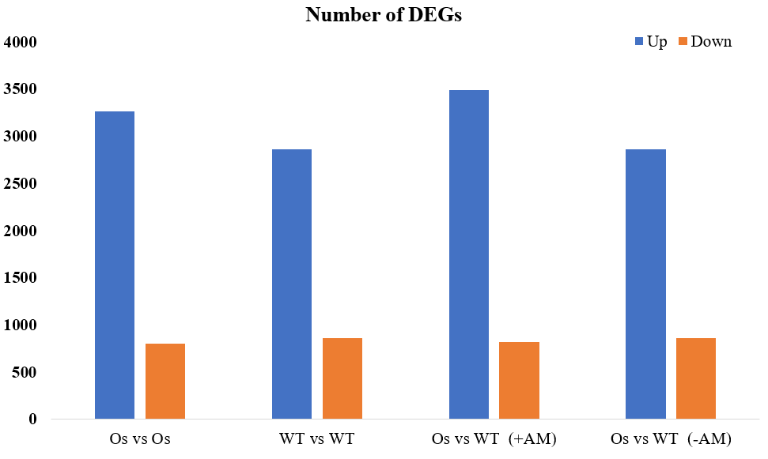
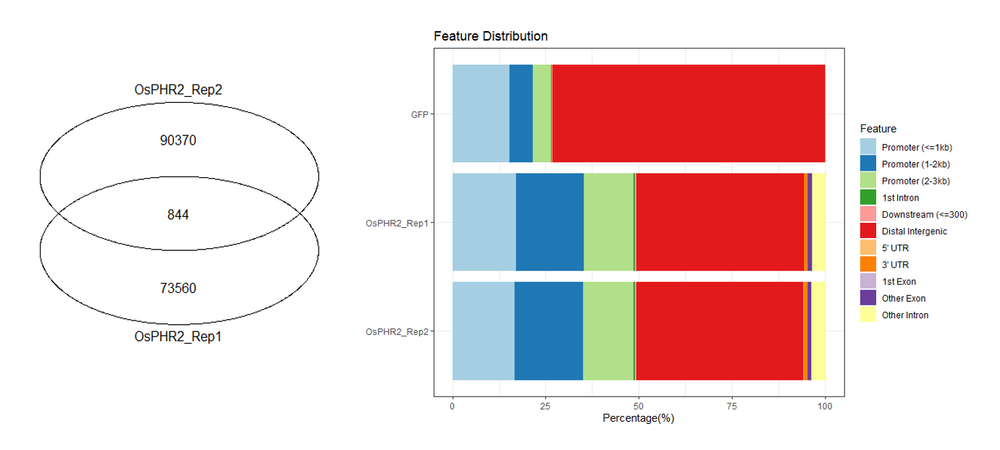
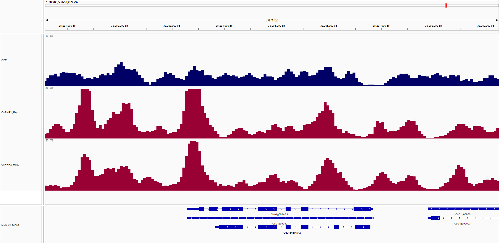
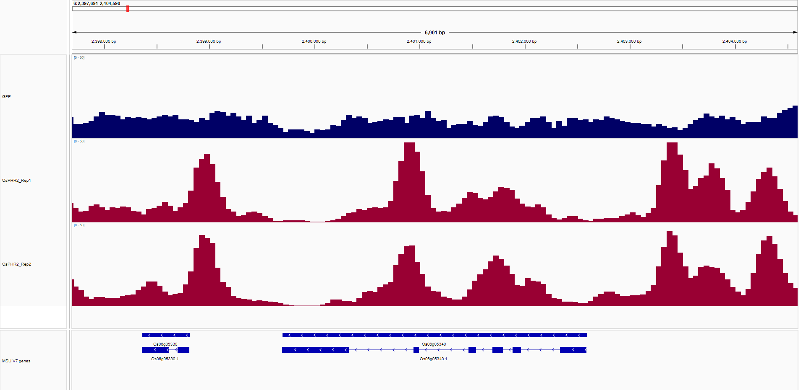
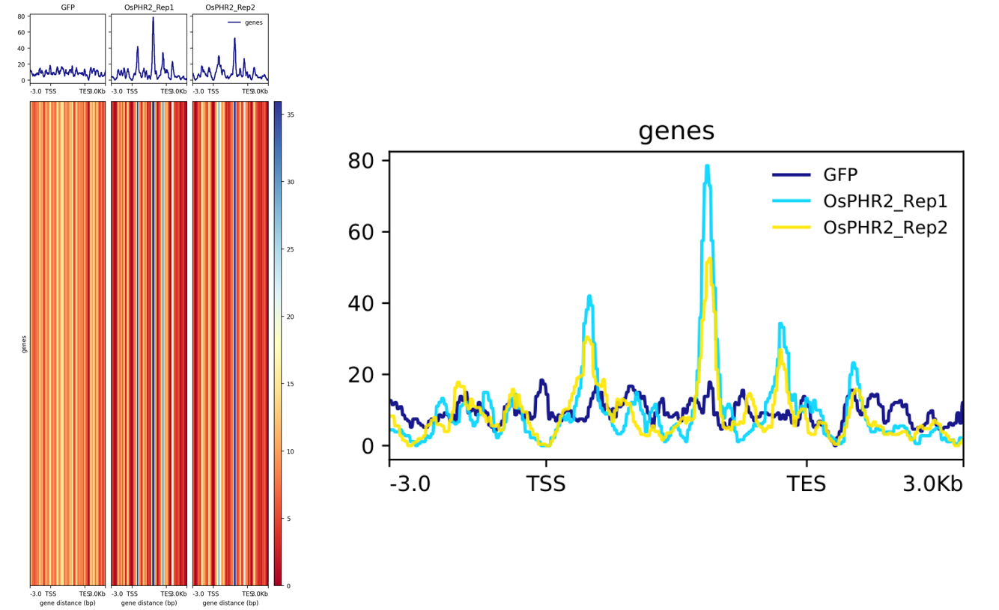
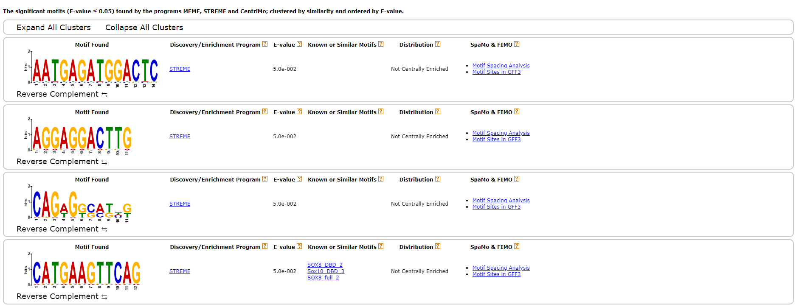

## Article Information

The title of the article is "A phosphate starvation response-regulated receptor-like kinase, OsADK1, is required for mycorrhizal symbiosis and phosphate starvation responses". The article was published in New Phytologist (Q1 in Chinese Academy of Sciences, IF=9.3, First Author: Jincai Shi, Corresponding Author: Ertao Wang).

Here, we reproduce the RNA-seq and DAP-seq data analysis sections of this article, and the resulting data files are in this repository.

Attention: There is a significant difference between the reproduced results and the original results.

## RNA-seq

RNA-seq data is available in the National Genomic Database: [CNP0003633](https://db.cngb.org/search/project/CNP0003633/)

```bash
wget -c -nH -np -r -R "index.html*" --cut-dirs 4 ftp://ftp.cngb.org/pub/CNSA/data5/CNP0003633/CNS0625460/
wget -c -nH -np -r -R "index.html*" --cut-dirs 4 ftp://ftp.cngb.org/pub/CNSA/data5/CNP0003633/CNS0625461/
wget -c -nH -np -r -R "index.html*" --cut-dirs 4 ftp://ftp.cngb.org/pub/CNSA/data5/CNP0003633/CNS0625462/
wget -c -nH -np -r -R "index.html*" --cut-dirs 4 ftp://ftp.cngb.org/pub/CNSA/data5/CNP0003633/CNS0625463/
wget -c -nH -np -r -R "index.html*" --cut-dirs 4 ftp://ftp.cngb.org/pub/CNSA/data5/CNP0003633/CNS0625464/
wget -c -nH -np -r -R "index.html*" --cut-dirs 4 ftp://ftp.cngb.org/pub/CNSA/data5/CNP0003633/CNS0625465/
wget -c -nH -np -r -R "index.html*" --cut-dirs 4 ftp://ftp.cngb.org/pub/CNSA/data5/CNP0003633/CNS0625466/
wget -c -nH -np -r -R "index.html*" --cut-dirs 4 ftp://ftp.cngb.org/pub/CNSA/data5/CNP0003633/CNS0625467/
wget -c -nH -np -r -R "index.html*" --cut-dirs 4 ftp://ftp.cngb.org/pub/CNSA/data5/CNP0003633/CNS0625468/
wget -c -nH -np -r -R "index.html*" --cut-dirs 4 ftp://ftp.cngb.org/pub/CNSA/data5/CNP0003633/CNS0625469/
wget -c -nH -np -r -R "index.html*" --cut-dirs 4 ftp://ftp.cngb.org/pub/CNSA/data5/CNP0003633/CNS0625470/
wget -c -nH -np -r -R "index.html*" --cut-dirs 4 ftp://ftp.cngb.org/pub/CNSA/data5/CNP0003633/CNS0625471/
```

The downloaded files are in the fastq.gz format and can be used without decompression. Place all the files in the fastqgz folder.

The original article stated: `The cleaned reads were mapped against the O. sativa ssp. Japonica cv Nipponbare reference genome (http://rice.plantbiology.msu.edu)`, but did not mention the software used for alignment. Therefore, we used the commonly used hisat2 to align the reads to the reference genome, using the genome from the [RGAP](http://rice.uga.edu/) database to build the hisat2 index. However, in the actual process, featureCounts failed to count from exons after aligning with the RGAP genome, so we switched to the [Ensembl Plants](https://plants.ensembl.org/index.html) genome instead:

```bash
hisat2-build -p 4 Oryza_sativa.IRGSP-1.0.dna.toplevel.fa Oryza_sativa
```

First, create the files_list.txt file and write the file prefixes for batch processing:

```txt
Osphr123_-AM1
Osphr123_AM1
Osphr123_-AM2
Osphr123_AM2 
Osphr123_-AM3
Osphr123_AM3
Wildtype_-AM1
Wildtype_AM1
Wildtype_-AM2
Wildtype_AM2
Wildtype_-AM3
Wildtype_AM3
```

Align the sequencing data to the reference genome:

```bash
cat ./files_list.txt | while read id;
do
    hisat2 \
    -x ./Oryza_sativa/Oryza_sativa \
    -p 5 \
    -1 ./fastqgz/${id}_1.fastq.gz \
    -2 ./fastqgz/${id}_2.fastq.gz \
    -S ./compared/${id}.sam
done
```

- -p specifies the number of threads to use
- -x specifies the path to the index file of the reference genome
- -1 specifies the path to the first pair of sequencing data
- -2 specifies the path to the second pair of sequencing data
- -S specifies the path to the output alignment result file

After completion, we obtain the sam files, and then we need to sort and compress them into bam files:

```bash
cat ./files_list.txt | while read id ;do
    samtools \
    sort \
    -n -@ 5 \
    ./compared/${id}.sam \
    -o ./sorted/${id}.bam
done
```

The article also did not mention the quantification software used, so we used the commonly used featureCounts:

```bash
nohup featureCounts \
-T 5 \
-t exon \
-g Name \
-a Oryza_sativa.IRGSP-1.0.58.chr.gff3 \
-o counts \
-p Osphr123_-AM1.bam Osphr123_AM1.bam Osphr123_-AM2.bam Osphr123_AM2.bam Osphr123_-AM3.bam Osphr123_AM3.bam Wildtype_-AM1.bam Wildtype_AM1.bam Wildtype_-AM2.bam Wildtype_AM2.bam Wildtype_-AM3.bam Wildtype_AM3.bam &
```

- -T: specifies the number of threads to be used.
- -t: specifies the type of feature to be counted.
- -g: specifies the gene identifier to be used for grouping.
- -a: specifies the annotation file of the reference genome.
- -o: specifies the name of the file to output feature counts.
- -p: specifies the BAM file to be counted.

After obtaining the counts matrix, which is a transcript level expression matrix by default, it needs to be converted to a gene level expression matrix for subsequent analysis. This can be achieved by using the Trans Value Sum tool of TBtools to merge different transcripts, followed by FPKM normalization:

```r
rm(list = ls())

counts <- read.csv(
    'counts',
    header = TRUE,
    sep = '\t',
    # row.names = "Geneid",
    comment.char = '#',
    check.names = FALSE
)

# Calculate FPKM for the data after the 6th column
for (clm in colnames(counts)[6:ncol(counts)]) {
    col_fpkm <- paste0(clm, "_FPKM")     # The new column name with the suffix "_FPKM"
    total <- sum(counts[, clm])          # Calculate the total reads for each sample
    counts[col_fpkm] <- (counts[, clm] * 10^6) / (counts[, "Length"] / 1000)  # Calculate FPKM for the corresponding sample using its length value and add FPKM column
}

# Delete the original counts
counts = counts[,-c(2:19)]

numeric_mask <- sapply(counts, is.numeric)
counts[numeric_mask] <- lapply(counts[numeric_mask], function(x) ifelse(x < 1, x + 1, x))

write.table(counts, file = 'fpkm_output', sep = '\t', row.names = FALSE)
```

After obtaining the standardized matrix, perform differential expression analysis. The original text 'The differentially expressed genes (DEGs) were identified using the R package DEGseq v.1.20.0 in different comparisons with P-value < 0.001 and |Fold change| > 2.' mentioned the use of the DEGseq package. However, the DESeq2 package has more powerful, precise and robust features than the DEGseq package. Therefore, the DESeq2 package is used here for differential expression analysis:

```r
rm(list = ls())  
Sys.setenv(LANGUAGE = "en")

library(DESeq2)

fpkm = read.csv(
    'fpkm_merge', 
    header = T,  
    sep = '\t', 
    row.names = "Geneid", 
    comment.char = '#', 
    check.name = F
)

# Round to the nearest integer
fpkm <- round(fpkm)

# Set all missing values to 1
numeric_mask <- sapply(fpkm, is.numeric)
fpkm[numeric_mask] <- lapply(fpkm[numeric_mask], function(x) ifelse(is.numeric(x) & x < 1, x + 100, x))

# Keep only rows that the sum of each row is greater than 10
fpkm <- fpkm[rowSums(fpkm)>10, ]

# Ensure that all decimals are converted to integers
fpkm[-1, ] <- apply(fpkm[-1, ], 2, as.integer)

# If there are any missing values, delete those rows/columns
missing_values <- sum(is.na(fpkm))
if (missing_values > 0) {
  fpkm <- na.omit(fpkm)
}

samples = data.frame(
    sampleID = c("Osphr123_-AM1", "Osphr123_-AM2", "Osphr123_-AM3", "Osphr123_AM1", "Osphr123_AM2", "Osphr123_AM3", "Wildtype_-AM1", "Wildtype_-AM2", "Wildtype_-AM3", "Wildtype_AM1", "Wildtype_AM2", "Wildtype_AM3"), 
    sample = c("Osphr123_reduce_AM", "Osphr123_reduce_AM", "Osphr123_reduce_AM", "Osphr123_add_AM", "Osphr123_add_AM", "Osphr123_add_AM", "Wildtype_reduce_AM", "Wildtype_reduce_AM", "Wildtype_reduce_AM", "Wildtype_add_AM", "Wildtype_add_AM", "Wildtype_add_AM")
)

rownames(samples) = samples$sampleID
samples$sample = factor(samples$sample, levels = c('Osphr123_reduce_AM', 'Osphr123_add_AM', 'Wildtype_reduce_AM', 'Wildtype_add_AM'))
dds = DESeqDataSetFromMatrix(countData = fpkm, colData = samples, design = ~sample)
dds_count <- DESeq(dds, fitType = 'mean', minReplicatesForReplace = 7, parallel = FALSE)

Osphr123_reduce_AM_vs_Osphr123_add_AM <- results(dds_count, contrast = c('sample', 'Osphr123_reduce_AM', 'Osphr123_add_AM'))
Wildtype_reduce_AM_vs_Wildtype_add_AM <- results(dds_count, contrast = c('sample', 'Wildtype_reduce_AM', 'Wildtype_add_AM'))
Wildtype_add_AM_vs_Osphr123_add_AM <- results(dds_count, contrast = c('sample', 'Wildtype_add_AM', 'Osphr123_add_AM'))
Wildtype_reduce_AM_vs_Osphr123_reduce_AM <- results(dds_count, contrast = c('sample', 'Wildtype_reduce_AM', 'Osphr123_reduce_AM'))

result1 <- data.frame(Osphr123_reduce_AM_vs_Osphr123_add_AM, stringsAsFactors = FALSE, check.names = FALSE)
result2 <- data.frame(Wildtype_reduce_AM_vs_Wildtype_add_AM, stringsAsFactors = FALSE, check.names = FALSE)
result1 <- data.frame(Wildtype_add_AM_vs_Osphr123_add_AM, stringsAsFactors = FALSE, check.names = FALSE)
result2 <- data.frame(Wildtype_reduce_AM_vs_Osphr123_reduce_AM, stringsAsFactors = FALSE, check.names = FALSE)
write.table(result1, 'Osphr123_reduce_AM_vs_Osphr123_add_AM.DESeq2.txt', col.names = NA, sep = '\t', quote = FALSE)
write.table(result2, 'Wildtype_reduce_AM_vs_Wildtype_add_AM.DESeq2.txt', col.names = NA, sep = '\t', quote = FALSE)
write.table(result1, 'Wildtype_add_AM_vs_Osphr123_add_AM.DESeq2.txt', col.names = NA, sep = '\t', quote = FALSE)
write.table(result2, 'Wildtype_reduce_AM_vs_Osphr123_reduce_AM.DESeq2.txt', col.names = NA, sep = '\t', quote = FALSE)
```

Filter the data based on thresholds:

| | Up | Down |
| - | - | - |
| Os vs Os | 3266 | 803 |
| WT vs WT | 2865 | 858 |
| Os vs WT  (+AM) | 3489 | 816 |
| Os vs WT  (-AM) | 2865 | 858 |



## DAP-seq

DAP-seq data is available in the National Gene database: [CNP0003634](https://db.cngb.org/search/project/CNP0003634/)

```bash
wget -c -nH -np -r -R "index.html*" --cut-dirs 4 ftp://ftp.cngb.org/pub/CNSA/data5/CNP0003634/CNS0625472/
wget -c -nH -np -r -R "index.html*" --cut-dirs 4 ftp://ftp.cngb.org/pub/CNSA/data5/CNP0003634/CNS0625473/
wget -c -nH -np -r -R "index.html*" --cut-dirs 4 ftp://ftp.cngb.org/pub/CNSA/data5/CNP0003634/CNS0625474/
```

The downloaded files are fastq.gz files, which can be used without decompression, place all files in the fastqgz folder.

According to the original text `the cleaned DAP-seq reads were mapped to the Nipponbare reference genome (https://rice.plantbiology.msu.edu/) using Bowtie2`, build bowtie2 index using the genome of [Ensembl Plants](https://plants.ensembl.org/index.html) instead of [RGAP](http://rice.uga.edu/) database:

```bash
bowtie2-build Oryza_sativa.IRGSP-1.0.dna.toplevel.fa Oryza_sativa
```

Create a files_list.txt file first, write the file prefixes for batch processing:

```txt
GFP
OsPHR2_Rep1
OsPHR2_Rep2
```

Map the sequencing data to the reference genome:

```bash
mkdir compared
cat ./files_list.txt | while read id;
do
    bowtie2 \
    -p 10 -x Oryza_sativa/Oryza_sativa \
    -1 ./fastqgz/${id}_1.fastq.gz \
    -2 ./fastqgz/${id}_2.fastq.gz \
    -S ./compared/${id}.sam
done
```

- -p specifies the number of threads used
- -x specifies the path to the index file of the reference genome
- -1 specifies the file path of the first pair of sequencing data
- -2 specifies the file path of the second pair of sequencing data
- -S specifies the file path to output the alignment result

After completion, you will get the sam files, then sort and compress the sam files into bam files and build an index for the bam files for further analysis:

```bash
mkdir sorted
cat ./files_list.txt | while read id;
do
    samtools sort ./compared/${id}.sam -o ./sorted/${id}.bam
    samtools index ./sorted/${id}.bam
done
```

Perform peak calling using MACS2 with Q-value ≤ 0.05 according to the original text:

```bash
mkdir peaks
cat ./files_list.txt | while read id;
do
    macs2 callpeak -t ./sorted/${id}.bam -f BAM -g 3.6e+8 -n ./peaks/${id} --qvalue 0.05
done
```

- -f specifies the input file format
- -g specifies the size of the genome
- --qvalue specifies the qvalue value

Annotate and visualize the peaks. Since the original text did not mention the software used, ChIPseeker package is used for annotation, and a Venn diagram is plotted:

```r
rm(list = ls())  
library("GenomicFeatures")
library("ChIPseeker")
spombe <- makeTxDbFromGFF("./peaks/all.gff3")

gfp <- readPeakFile('./peaks/GFP.bed')
Rep1 <- readPeakFile('./peaks/OsPHR2_Rep1.bed')
Rep2 <- readPeakFile('./peaks/OsPHR2_Rep2.bed')

peaks <- list(GFP=gfp, OsPHR2_Rep1=Rep1, OsPHR2_Rep2=Rep2)
OsPHR2_peaks <- list(OsPHR2_Rep1=Rep1, OsPHR2_Rep2=Rep2)

peakAnno <- lapply(peaks, annotatePeak, tssRegion = c(-3000, 3000), TxDb = spombe)

plotAnnoBar(peakAnno)

vennplot(OsPHR2_peaks)
```

Result:



Generate coverage using DeepTools, normalize to FPKM (Fragments per kilobase million) and then for IGV view, define peak regions based on the annotations of the reference genome.

```bash
mkdir bigwig
cat ./files_list.txt | while read id;
do
    bamCoverage -b ./sorted/${id}.bam -o ./bigwig/${id}.bw --normalizeUsing RPKM
done
```

Import the bigWig files into IGV for visualization:




Next, we need to calculate the signal abundance of the samples. We need a bed file for this purpose. The deeptools documentation suggests downloading a bed file from [UCSC](http://genome.ucsc.edu/cgi-bin/hgTables?command=start), but since the UCSC database does not have rice data, we manually create a `OsPHR2.bed` file based on the instructions for [BED format](http://genome.ucsc.edu/FAQ/FAQformat.html#format1) on UCSC, by organizing the following information from the genome annotation file:

```txt
chr7    14753753        14759288        OsPHR2  cds     +
```

Then, we use computeMatrix to calculate the signal abundance:

```bash
cd bigwig
nohup computeMatrix \
scale-regions \
-p 10 \
-R OsPHR2.bed \
-S GFP.bw OsPHR2_Rep1.bw OsPHR2_Rep2.bw \
-b 3000 \
-a 3000 \
--regionBodyLength 5000 \
--skipZeros \
-o tss-tts.gz &
```

- scale-regions scales the measurement data to fit the specified regions for calculation
- -p specifies the number of threads to use when computing the matrix
- -R specifies the BED file for the reference regions
- -S specifies the signal files to be used for calculation
- -b specifies the length of the upstream region in the reference region
- -a specifies the length of the downstream region in the reference region
- -o specifies the output file
- --regionBodyLength specifies the length of the region body in the reference region
- --skipZeros skips regions with zero values when computing the matrix

Use plotProfile and plotHeatmap for visualization. plotProfile plots the results of all bigWig files in the same graph, while plotHeatmap separates the results of the bigWig files and plots a heatmap:

```bash
plotProfile --dpi 720 -m tss-tts.gz -out tss-tts.pdf --plotFileFormat pdf --perGroup
plotHeatmap -m tss-tts.gz -out tss-tts.png
```


Finally, use the [MEME-Chip](https://meme-suite.org/meme/tools/meme-chip) tool to identify the motif of OsPHR2 using DNA sequences.


